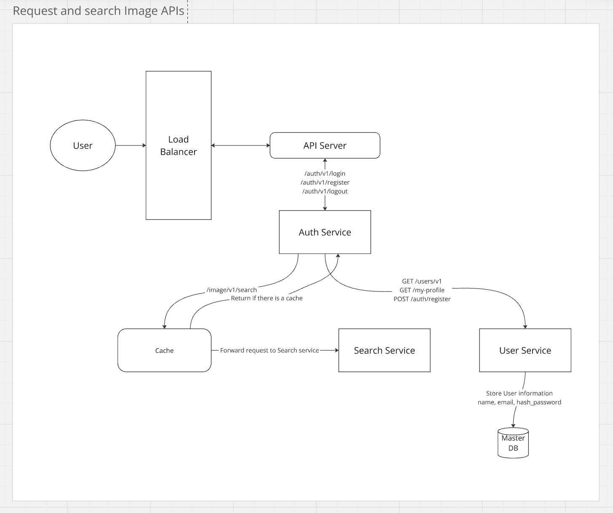

## A. Functional Requirements:
1. Be able to search image from **three** third party API (Unsplash, pixabay, and Storyblocks).
2. The application should handle third-party API errors, including response errors (e.g., Unsplash) or null results (e.g., Pixabay), and still return images from other APIs if one fails.
3. Should have authentication (login, register and logout).
4. Only can search image after login
5. Using GraphQL.
6. Deploy using docker image, with CI/CD pipeline like GitHub action/Gitlab or CircleCI
7. Deploy it to cloud infrastructure like AWS, GCP or Azure
8. Create documentation how to deploy to the cloud service.
9. Be able to handle large amounts of request together ( 1,000 read / second)
10. Provide the load test method and result.

## B. Non-functional Requirements:
1. **Security**: Ensure that authentication is implemented to keep the APIs secure.
2. **Error Handling**: Proper error handling should be implemented to manage third-party API failures and other potential issues.
3. **Documentation**: Provide clear and comprehensive documentation for understanding the APIs and their usage.
4. **Low Latency**: The system should have low latency in handling requests, especially for image search.
5. **High Availability**: Ensure the system is highly available, capable of handling high traffic with minimal downtime.

## C. API Layer:
### Mutations
| Mutation Name | Input                 |
|---------------|-----------------------|
| registerUser  | name, email, password |
| login         | email, password       |
| logout        | JWT_auth_token        |

### Queries
| Query Name | Input |
|------------|-------|
| users      | NA             |                               |
| myProfile  | JWT_auth_token |
| images | NA |
| searchImages | searchTerm |

## D. Database Layer:
| User Schema |                                     |
|-------------|-------------------------------------|
| id          | userId AS UUID PRIMARY KEY NOT NULL |
| username    | VARCHAR                             |
| email       | VARCHAR NOT NULL UNIQUE             |
| password    | VARCHAR NOT NULL                    |

## E. Deep Dive:
The main focus of this API is to handle a large number of requests, around 1,000 reads per second.
### Solution:
1. **Caching**  
    Use caching strategies to reduce the load on the image APIs and improve response times.
    - Pros: Simple to set up, no external dependencies, cost-effective for small-scale apps.
    - Cons: Limited scalability (in-memory), may not handle high traffic or horizontal scaling well.
2. **Rate limiting**  
     Implement mechanisms to limit the number of requests from a user in a given time period.
    - Pros: Helps prevent abuse, ensures fair usage, and protects APIs from being overwhelmed by too many requests. 
    - Cons: May lead to user frustration if not properly tuned or if limits are too strict.
3. **Load Balancing**  
     Distribute traffic evenly across multiple servers or services to handle the large number of requests.
    - Pros: Enhances availability and reliability, ensures even distribution of load, prevents single points of failure. 
    - Cons: Can add complexity in setup and maintenance, may require more infrastructure and resources.
4. **Asynchronous Requests**:   
     Trigger all API calls simultaneously (in parallel) to optimize request time.
    - Pros: Improves speed, reduces waiting time by fetching data from all APIs at once, and avoids bottlenecks.
    - Cons: Can be harder to manage when dealing with failures or timeouts, and may lead to overloading if not properly handled.
5. **Retry Logic**  
     Implement automatic retry mechanisms for failed API calls to ensure that users still receive results from available sources.
    - Pros: Increases reliability by attempting to get results even after failures, improves user experience by ensuring successful API calls. 
    - Cons: May increase response time if retries are not handled efficiently, and excessive retries can cause strain on the APIs.

## F. High Level Design

### End-to-end flow summarized
1. **User sends a request (e.g., image search)** -> Load Balancer routes the request to the API Server.
2. **API Server checks the Cache:**
   - Cache Hit: Return the cached image response. 
   - Cache Miss: Forward the request to the Image Service.
3. **Image Service:** -> Makes asynchronous calls to the third-party APIs (Unsplash, Pixabay, Storyblocks) simultaneously.
4. **Retry Logic:** -> If an API request fails, retry up to 3 times with a 1-second delay.
5. **Error Handling:** -> If any third-party API returns an error or null results, fallback to another API to ensure the user gets an image.
6. **Image Service stores the caches** the response for future requests. 
7. **API Server returns the response** to the user or an error message if no image was found.